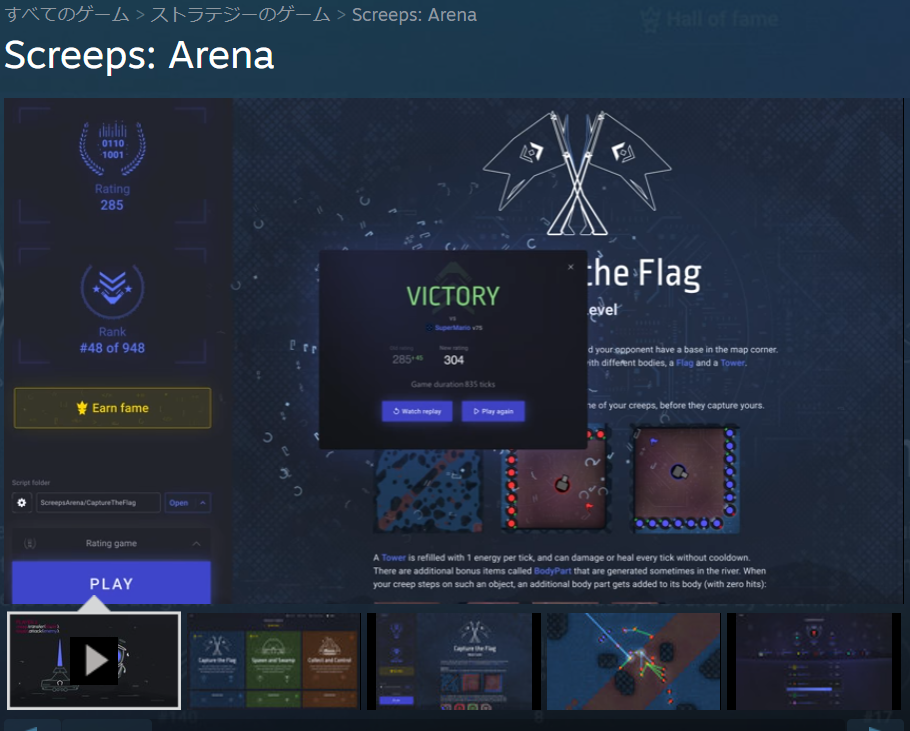
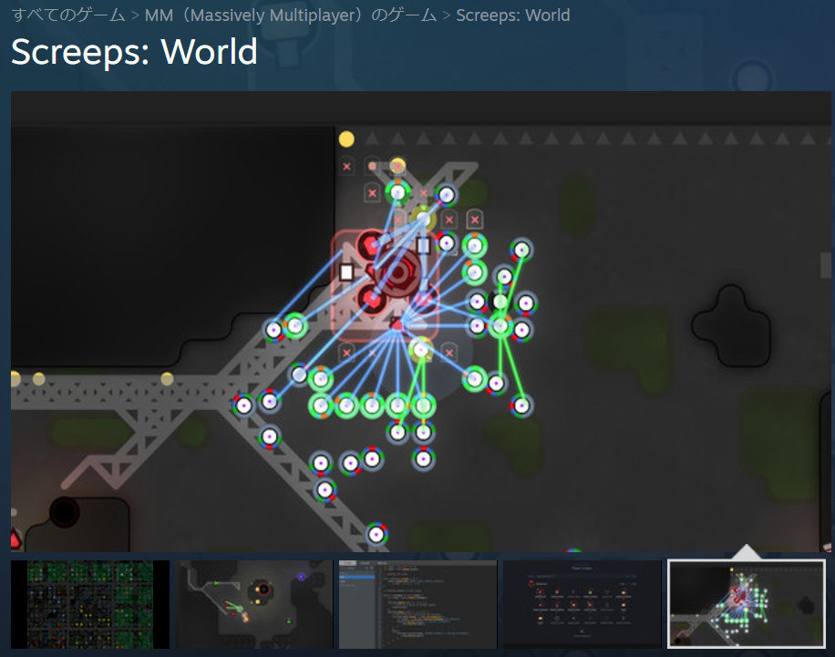
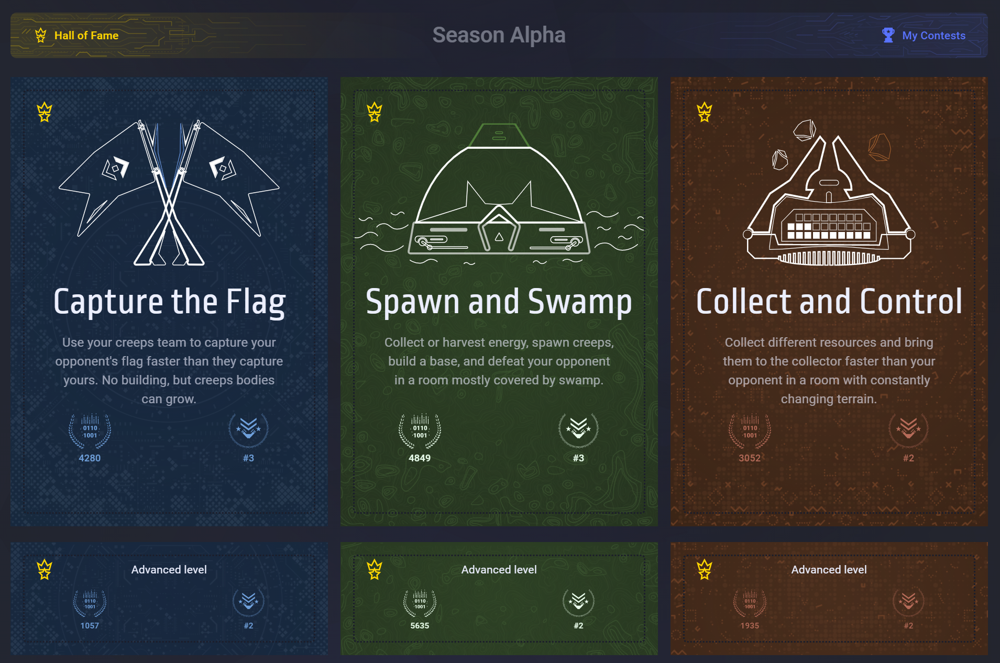

# Screeps: Arena における<br />多プログラミング言語対応について

こーのいけ 2024/12/11 新宿御苑.wasm #2024.12.11

---
---

# TL; DR

今北産業

「色んな言語で bot AI が書ける!」というふれこみのScreeps: Arena の話

「チュートリアルやってみますたｗｗｗ」じゃないよ

WebAssembly で色々な言語で書けるけど、結局 TypeScript で書いた方が楽

👆スライド書き終わって一番最後にココ書いたら三行目は Copilot が勝手に入れてくれた

---
---

# Who am I?

ふーあみ

こーのいけ

X: @ko_noike
github/zenn: kounoike

フリーランスエンジニア

なんか画像処理とか映像処理とかWebRTCとか録画鯖関係とか色々やってます。

TODO: icon, QR code

---
---

# Table of contents

<Toc maxDepth="1"></Toc>

---
---

# Screeps: Arena

コードを書いて対戦するプログラミングゲーム

Steam で販売されている、2,000 円くらいのゲーム

Screeps: World は別のゲーム（MMO ライクなプログラミングゲーム）

<div>


</div>

---
---

# Screeps: Arena 対応プログラミング言語

Screeps: Arena は以下のプログラミング言語に対応している…？

> You don't control your units directly, you play by writing full-fledged JavaScript that runs on game servers.
> Other languages are supported via WebAssembly: C/C++, Rust, TypeScript, Go, C#, F#, Kotlin, Swift, D, Pascal, Zig, the list is growing.

となっているが…？


---
---

# Screeps: Arena ゲームの記述方法

JavaScript で書く場合の記述方法

適当なディレクトリをゲーム内で指定すると、
そのディレクトリの中身を zip してアップロードしてくれる

その中の main.mjs ファイルで loop 関数をエクスポートすると、それがゲームの毎 tick （ターン）ごとに呼び出される


```js
import { getObjectsByPrototype, getTicks } from 'game/utils';
import { Creep } from 'game/prototypes';

export function loop(){
    const ticks = getTicks();
    console.log(`Hello, now ${ticks} ticks`);

    const creeps = getObjectsByPrototype(Creep);
    const myCreep = creeps.find(c => c.my);
    if (myCreep) {
        myCreep.moveTo({x: 10, y: 10});
    }
}
```

---
---

# ユーザが書いたコードを実行する仕組み

誰が書いたか分からないコードを **安全** に実行する仕組み

Screeps: Arena のサーバでは V8 Runtime の isolate-vm でユーザが書いたコードを実行している

（wasmer とかの WebAssembly runtime **では無い**）

→ TypeScript で書いたらユーザがトランスパイルして（JavaScript にして）アップロードする

→ V8 Runtime で動いているので WebAssembly が使える

→ WebAssembly が使えるならどんな言語でも使える（？？？）

---
---

# WebAssembly 対応のホントのところ

Screeps: Arena は WebAssembly が使えると言っているが、実際はどうなのか？

- WebAssembly.instanciate() は使える
- ネットワーク関連はもちろん、fs モジュールも使えないので、.wasm ファイルを直接読むことは出来ない

→バンドラで JavaScript に **文字列として** 埋め込むことになる

- 文字列にする都合上、Base64 エンコードする必要がある
- （多分ランタイムのバージョンの関係で？）atob 関数とかが使えない

→自前で Base64 エンコードする必要がある

- JavaScript で書かれた Base64 ライブラリが必要（npm にある）

（ついでにログ表示とかに UTF-8 変換が必要だがそれも使えないので npm からフル JavaScript のライブラリを持ってくる）

---
---

# WebAssembly 対応のホントのところ (2) 関数・型

ゲームに必要な関数・型関係

Screeps: Arena ではゲームに必要な関数（getObjects とか findPath とか）はインポート可能な js ファイルを**サーバ側で追加**して実行される
（ユーザはどんな実装になってるか分からない）
また、それらの関数とそれらの関数が使うオブジェクトの型情報は

- **TypeScript の型定義ファイル** でユーザコミュニティから提供されている
- リリース後だいぶ経ってから JS の typings ファイルが提供された
- 他の言語の場合は自分で定義する必要がある（Rust, C# などはユーザコミュニティが公開している）
    - しかも、普通に WebAssembly Module に import/export で橋渡しをしなければならない

---
---

# WebAssembly 対応のホントのところ (3) 結論

結局どうなのか？

WebAssembly で色々な言語で書ける！　…ただし、すっごい頑張ればね！

ユーザコミュニティが頑張ってる言語なら何とか…

Rust/.Net/Python あたりはユーザコミュニティが頑張ってるみたいだけど…？

**正直 JavaScript or TypeScript で書いた方が圧倒的に楽**

（.Net で頑張っている人がいるおかげで F# で書いてる人がいるみたいで、それはちょっと面白そう）

---
---

# それでも何故 WebAssembly を使うのか？

Screeps: Arena の制限

Screeps: Arena のユーザコードには以下のような制限がある

- 実行時間制限
  - 1 tick あたり 50ms まで（最初の tick だけ 1000ms）
  - とはいえ、WebAssembly で書いたからと言って爆速になるわけではない
- メモリ制限
  - JavaScript のヒープサイズに制限がある
  - ところが、WebAssembly の線形メモリはこの制限には **含まれない**
  - 100x100 x 100x100 のUInt32Array を JavaScript では作れないが、WebAssembly なら作れる
    - マップの任意の点から任意の点への移動経路を計算した結果をキャッシュするのに使える

---
---

# で、どの言語がオススメ？

閑話~~休題~~暴走

基本的には TypeScript で書く（やっぱり型があるのは嬉しい）

経路探索とかの重い処理・キャッシュにメモリを使いたい場合は WebAssembly で書く

> 実行時間制限 1tick あたり 50ms

この制限が来ると、WebAssembly の中でどんな処理をしているタイミングだろうが処理が打ち切られる。
そして、そんなことにはお構いなく次の tick の処理が始まる。

⇒ メモリ管理周りの処理してる途中で打ち切られているとぶっ壊れる

**そんなとき便利なのが Zig 言語の `fixedBufferAllocator`**

ヒープではなく固定領域のバッファ内からメモリを切り出していくので、Tick ごとに初期化して使っていれば安全


---
---

# 結果

で、どうなったか？

⇒全ゲームで 3 位以内!!!



